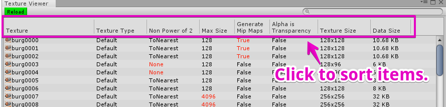

# UnityEditor-TextureViewer
Texture Viewer is a tool to view Textures in your Unity project.

# How to use

## How to open 
Select menu  **Tools > Texture Viewer** 

## Sorting
Click the column header to sort items.

## Search
This tool has a search field for filtering textures.

